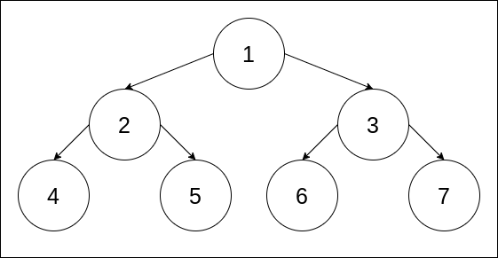

> ### All data structures implementations
>
> For a list of all the data structures I have implemented, click [here](https://gist.github.com/contactsunny/4a97886c7da57461efa8cd2538a49dbc).

---

# Binary Tree Implementation POC in Java

This is a simple example of a binary tree implementation in Java. We create a custom ```Node``` class which can take values of
generic type ```T```, so that we can create trees of different types using the same implementation class. We also create a 
```BinaryTree``` class which will hold the actual binary tree.

We provide three major traversals for our binary tree:
- pre order traversal
- in order traversal
- post order traversal

# Use of the generic class ```T```

If you check the ```Node``` class, I'm taking the generic class ```T``` as the type of the value field. This is so that during
runtime, we can have a string binary tree or integer binary tree, or a binary tree of a custom class as well. ```T``` is a generic class in Java,
the type of which can be decided in runtime.

# Running the project

Once you clone this repo, ```cd``` into the project root directory and run the following command to compile and build this maven project:

```shell script
mvn clean install
```

Once you run this command, Maven will build the project and keep it in the ```/target``` directory in the project root directory.
You can run the program using the command below:

```shell script
java -jar target/BinaryTree_Implementation_Java_POC-1.0-SNAPSHOT.jar
```

# Illustrating different traversals

For our example, we'll consider the following binary tree, which is a very simple example: 



The following traversals will are for this example binary tree:

### Pre order traversing:

In this type of traversal, we first traverse to the node, then the left child, then the right child. You can create
a much longer tree in your example and find out how it functions when there are move levels.

```shell script
1 2 4 5 3 6 7
```

### In order traversing:

In this type of traversal, we first traverse to the left child, then the node, then the right child.

```shell script
4 2 5 1 6 3 7
```

### Post order traversing:

In this type of traversal, we first traverse to the left child, then the right child, and finally the node, .

```shell script
4 5 2 6 7 3 1
```